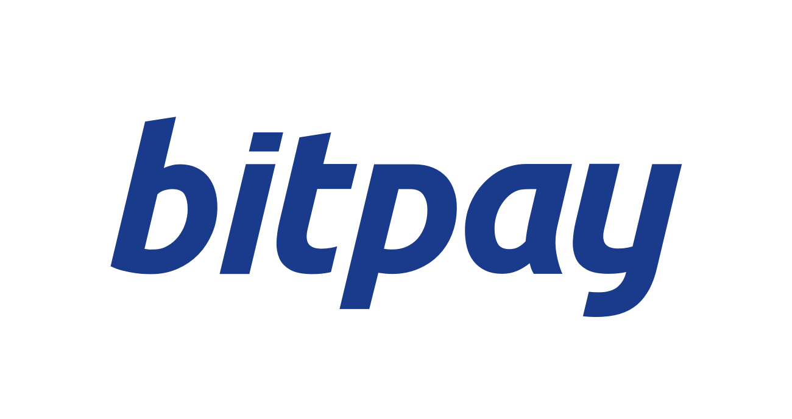

BitPay Brand
============

BitPay provides powerful integrations for businesses to add bitcoin as a payment method. With BitPay, businesses can accept bitcoin and get paid in US Dollars, Euros, GBP, CAD, and more, straight to a bank account.

Over 30,000 businesses and organizations including WordPress, Shopify, TigerDirect, and Virgin Galactic trust BitPay to enable bitcoin payments.

##Logo
###Primary logo
This is the best logo for all applications. It is the [white logo](bitpay-logo-primary.png) on the BitPay Blue background.

###Logo inverted

##BitPay

BitPay is written with the `B` and `P` capitalized to distinguish BitPay (our company) from Bitcoin (the currency). In code, `bitpay` is all lowercase.

- ✓ **BitPay**
- ✓ **`bitpay`**
- × *Bitpay*
- × *bitPay*
- × *bit-pay*
- × *bit pay*

##BitPay Blue

The BitPay Blue is PMS 295. Please use official Pantone Matching System swatches where available.

###Close Matches

####sRGB

| Red | Green | Blue |
|:---:|:-----:|:----:|
|  0  |   40  |  85  |

#####Hex
`#002855`

####Bridge CMYK

| Cyan | Magenta | Yellow | Key (Black) |
|:----:|:-------:|:------:|:-----------:|
| 100  |   69    |   8    |      54     |
